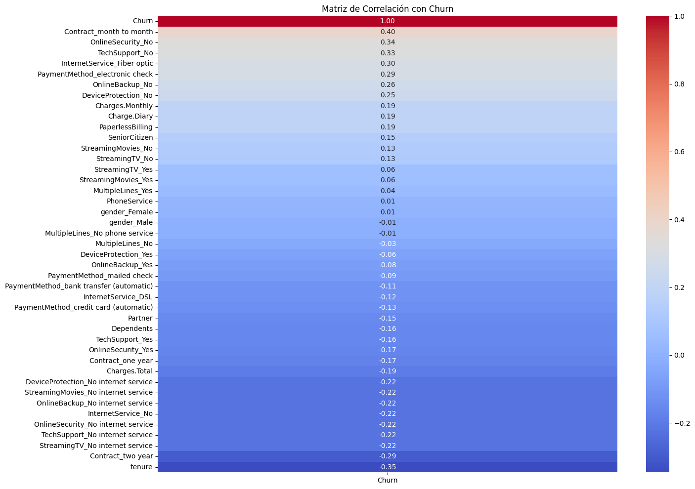
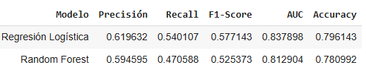
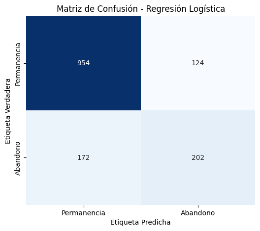
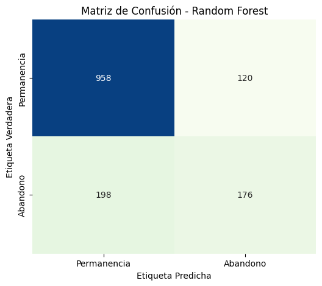
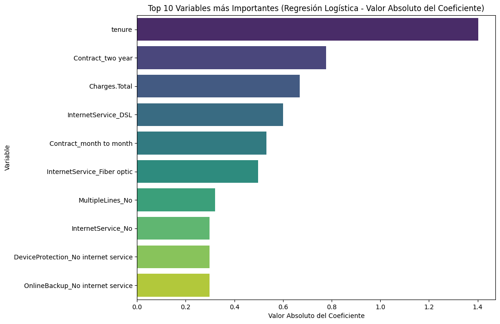
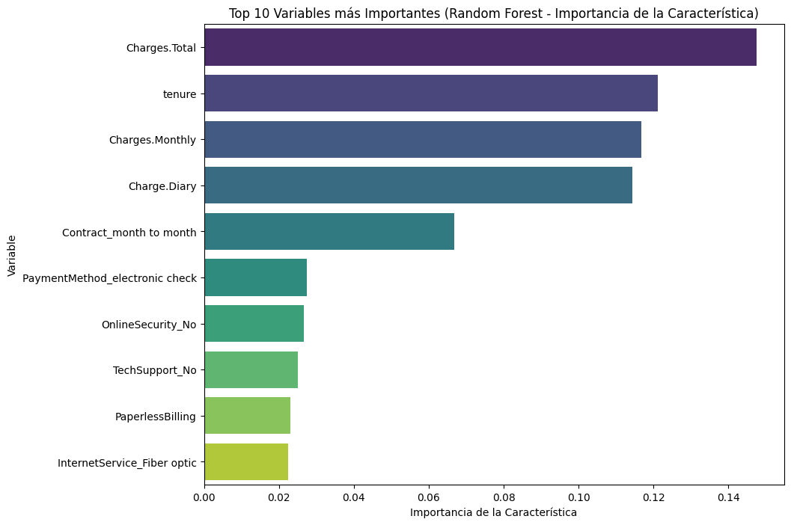

# 📴 Predicción del Abandono de clientes - TelecomX LATAM

Este proyecto busca predecir el potencial abandono de clientes en la empresa TelecomX y servir para la toma de decisiones a futuro cuando un nuevo cliente ingrese a la compañía determinar la probabilidad de cancelación del servicio y establecer políticas que permitan retener a los clientes.

---

## 📚 Índice

1. [📌 Propósito del Análisis](#propósito-del-análisis)
2. [📁 Estructura del Proyecto](#estructura-del-proyecto)
3. [💻 Preprocesamiento](#preprocesamiento)
4. [📊 Resultados](#resultados)
5. [💡 Conclusiones estratégicas](#conclusiones-estratégicas)

---

## 📌 Propósito del Análisis

El propósito de este análisis es:

- Preparar los datos para el modelado (tratamiento, codificación, normalización).
- Realizar análisis de correlación y selección de variables.
- Entrenar dos o más modelos de clasificación.
- Evaluar el rendimiento de los modelos con métricas.
- Interpretar los resultados, incluyendo la importancia de las variables.
- Crear una conclusión estratégica señalando los principales factores que influyen en la cancelación.

---

## 📁 Estructura del Proyecto

| Carpeta/Archivo               | Descripción                                                  |
|------------------------------|--------------------------------------------------------------|
| `TelecomX_2.ipynb`      | Notebook principal con el análisis predictivo              |
| `Image/`                    | Carpeta con gráficos exportados desde el notebook            |
| `README.md`                  | Archivo con documentación del proyecto                       |

---
## 💻 Preprocesamiento

### Preparación de los datos
En este análisis se cargo la base de datos luego de realizado el proceso ETL. Se vuelve a realizar una corroboración de la existencia o no de valores nulos, con el fin de corroborar que la base de datos se cargo correctamente. Se odifican las variables categóricas usando One-Hot Encoding, normalizar o escalar variables numéricas si es necesario para los modelos a utilizar se dividen los datos en conjuntos de entrenamiento y prueba.

### Selección de variables para modelar
Se calcula la matriz de correlación para identificar relaciones entre variables, especialmente con la variable objetivo (Churn), y seleccionar las variables que se utilizarán para entrenar los modelos.

### Entrenamiento de modelos de clasificación
Se entrena un modelo de regresión logística y un modelo de random forest para predecir el abandono de los clientes en la empresa TelecomX

---

## 📊 Resultados

En este apartado se expondrán los principales resultados que surgen de los modelos.

### 📈 Comparación métricas

Se evaluan los modelos entrenados utilizando el conjunto de prueba, se calculan las métricas de evaluación relevantes para problemas de clasificación (Precisión, Recall, F1-Score, AUC) y se comparan los rendimientos de los diferentes modelos.

---

### 📉 Matrices de confusión

---

### 📉 Visualización de la importancia de las variables

Para complementar la interpretación de los resultados, visualizaremos la importancia de las variables obtenidas de la Regresión Logística (basada en coeficientes) y del Random Forest. Esto facilitará la identificación de los factores clave que influyen en la cancelación.

---
## 💡 Conclusiones estratégicas

Principales hallazgos
Se identificaron 31 variables con una correlación absoluta superior a 0.1 con la variable objetivo Abandono.
El modelo de Regresión Logística obtuvo las siguientes métricas en el conjunto de prueba: Precisión = 0.6196, Recall = 0.5401, F1-Score = 0.5771, AUC = 0.8379 y Accuracy = 0.7961.
El modelo de Random Forest obtuvo las siguientes métricas en el conjunto de prueba: Precisión = 0.5946, Recall = 0.4706, F1-Score = 0.5254, AUC = 0.8129 y Accuracy = 0.7810.
La Regresión Logística mostró un rendimiento ligeramente superior al de Random Forest en Precisión, Recall, F1-Score y AUC en este análisis.
Las variables más influyentes en la Regresión Logística (basado en el valor absoluto del coeficiente) incluyen tenure, Contract_two year, Charges.Total, InternetService_DSL y Contract_month to month.
Las variables más importantes en Random Forest (basado en la importancia de las características) incluyen Charges.Total, tenure, Charges.Monthly, Charge.Diary y Contract_month to month.
Variables como tenure, Charges.Total y Contract_month to month fueron consistentes como factores importantes en ambos modelos.
Insights
Telecom X debe enfocar sus esfuerzos de retención en clientes con baja antigüedad, aquellos con contratos mensuales y los que utilizan métodos de pago específicos o ciertos servicios, ya que estos son los factores de riesgo más consistentes identificados por los modelos.
Se recomienda explorar técnicas adicionales de selección de variables, como la eliminación recursiva de características o métodos basados en modelos, para optimizar los modelos y potentially mejorar su rendimiento y interpretabilidad.
Interpretación de los Resultados y Conclusión Estratégica
Basándonos en las métricas de evaluación obtenidas para ambos modelos y en el análisis de la importancia de las variables, podemos extraer las siguientes conclusiones clave:

**Comparación de Modelos**: El modelo de Regresión Logística tuvo un rendimiento ligeramente superior en la mayoría de las métricas de evaluación (Precisión, Recall, F1-Score y AUC) en comparación con el modelo de Random Forest en este conjunto de datos. Esto sugiere que, para este problema particular, la Regresión Logística pudo capturar mejor la relación entre las características y la probabilidad de cancelación.

**Factores Clave de Cancelación**: La interpretación de los coeficientes de la Regresión Logística y la importancia de las características del Random Forest revelan consistentemente que la antigüedad del cliente (tenure), el tipo de contrato (especialmente contratos mes a mes frente a contratos a largo plazo) y los cargos totales (Charges.Total) o cargos mensuales (Charges.Monthly) son los predictores más importantes de la cancelación. Otras variables relevantes incluyen el tipo de servicio de Internet (Fibra Óptica vs DSL vs No Internet) y ciertos métodos de pago (como el cheque electrónico).

**Implicaciones Estratégicas**: Para reducir la tasa de cancelación, Telecom X debería centrar sus esfuerzos en los siguientes grupos de clientes y áreas:

- Clientes con baja antigüedad: Implementar programas de incorporación o incentivos especiales para retener a los clientes en sus primeros meses.
- Clientes con contratos mensuales: Ofrecer opciones de actualización a contratos a más largo plazo con beneficios adicionales para fomentar la lealtad.
- Clientes con altos cargos mensuales o totales: Investigar si estos cargos están alineados con el valor percibido por el cliente y considerar ofrecer planes o paquetes más atractivos.
- Clientes con servicio de Fibra Óptica o pago con cheque electrónico: Analizar si hay problemas específicos asociados con estos servicios o métodos de pago que estén contribuyendo a la cancelación y tomar medidas correctivas.
**Próximos Pasos**: Si bien los modelos actuales proporcionan información valiosa, se podrían explorar técnicas adicionales como la ingeniería de características más avanzada, la consideración de otros modelos (como Gradient Boosting) o la implementación de estrategias de manejo de desbalance de clases para potencialmente mejorar aún más la capacidad predictiva y la interpretabilidad.

En resumen, este análisis inicial ha identificado los principales impulsores de la cancelación de clientes en Telecom X, que va en línea con lo obtenido el análisis descriptivo, por ende proporciona una base sólida para desarrollar estrategias de retención de clientes más específicas y efectivas.

---
